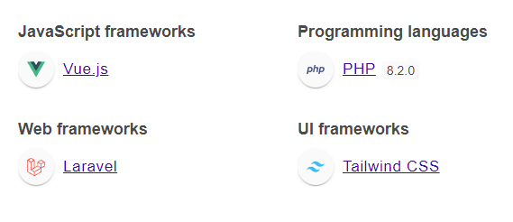

### Setup Locally

```
cd ./project
```

```
cp .env.example .env
```
```
set database credentials to .env file inside project folder

DB_DATABASE=database_name
DB_USERNAME=root
DB_PASSWORD=password
```

```
composer install
```

```
php artisan migrate
```

```
php artisan key:generate
```

### Client :

```
npm install
```

```
npm run dev or npm run build
```

```
php artisan serve
```

go [http://localhost:8000/#/master-price](http://localhost:8000/#/master-price)


## go to /master-price to view the resurce
